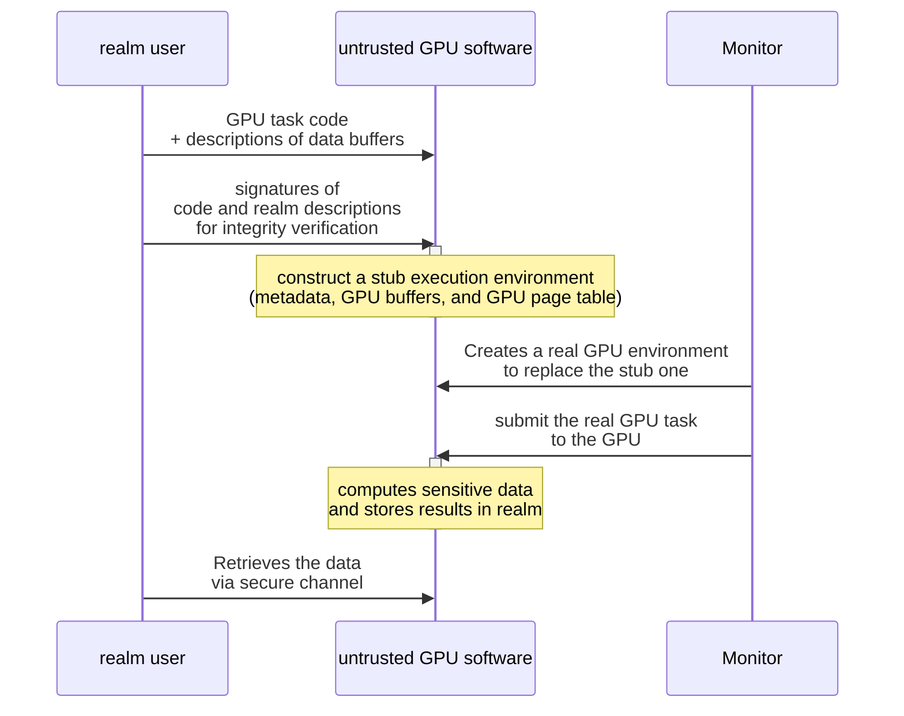

> [!quote]- Chenxu Wang, Fengwei Zhang, Yunjie Deng, Kevin Leach, Jiannong Cao, Zhenyu Ning, Shoumeng Yan, Zhengyu He. CAGE: Complementing Arm CCA with GPU Extensions. Proceedings 2024 Network and Distributed System Security Symposium, 2024.
> - [Link to paper site](https://www.ndss-symposium.org/wp-content/uploads/2024-763-paper.pdf)
> - [Link to pdf file](<file:///Users/sujin/Library/CloudStorage/OneDrive-GeorgiaInstituteofTechnology/Zotero/storage/W7L6JILM/Wang et al. - 2024 - CAGE Complementing Arm CCA with GPU Extensions.pdf>)

### Overview
![[Pasted image 20240305025636.png]]
1. Shadow task mechanism (smaller TCB)
2. Leverage native GPC support for GPU execution isolation

### GPU Workflow

### Shadow task mechanism
![[Pasted image 20240309032455.png]]

>[!example] Stub GPU task
> - Has the same structure as a normal GPU task (e.g., GPU buffers, metadata, and GPU page table) but does not contain any *sensitive data*
> - We require the GPU software on the host to create and manage the stub GPU task during the confidential GPU computing without frequent interactions with the hypervisor, the monitor, and the realms.

>[!example] Real GPU task
> - Includes sensitive data to be processed on the GPU
> - Monitor replace the stub task with the real task data and synchronize data-independent operations to the real task.

>[!question] Synchronizing the page table of the real task with the stub task
> - [c] copying the entire stub table to the real one
> - [c] synchronously replaying the operations on the stub table to the real one
> - [x] Since GPU software doesn't update GPU page table during execution, replay the previous operations on the stub table to the real one *asynchronously*
> - [x] GPU software records the new or updated entries of the stub page table in batch then submits them to the Monitor

### Two-way isolation: Through GPT configurations
![[Pasted image 20240309040523.png]]
#### CPU GPT & untrusted peripheral GPT (From CPU&Peripheral)
- Since Metadata and code buffers are reused, these regions are configured as *realm* in CPU GPU and peripheral GPTs. 
- The address of the reused metadata and code buffers can be compromised. Must check whether these regions overlap with other realm or root regions. 

#### GPU GPTs (From GPU)
- Each realm has unique GPU GPT, strictly isolated from other regions.
- Only allow access to the realm, reused metadata and code buffers

## Problems: How can we extend the support of GPU acceleration to Arm CCA?
- While CCA provides strong data security and enables confidential computing on next-generation Arm devices, the **support for GPUs** is only recently proposed.
- Such support, called RME Device Assignment (RME-DA), is currently a high-level concept without completed hardware implementation.
- Currently, CCA design characterizes the GPU as an *untrusted* peripheral on which data security is not guaranteed. As a result, if realms use the GPU for computation, their sensitive data can be accessed by the adversary who controls the GPU via compromised software

### Recent study
- ACAI: proposes a similar design to RME-DA
	- [c] Its protection mechanism requires non-trivial modification on RMM.
	- [c] It introduces heavyweight GPU software to realm’s TCB.
- Most TEE solutions for GPU rely on hardware security primitives that are not suitable for next-generation Arm devices (e.g., customized hardware, Intel-based security primitive, or traditional Arm security hardware)

## Solution: CAGE

### Four goals
#### G1. Compatibility with CCA
- Delegate the complex but *data-independent* functions (memory management + task scheduling) to the untrusted GPU software stack
- Ensure data security with a marginal increase in TCB
> [!success] Shadow task mechanism
>- To achieve confidential GPU computation on Arm devices
>- The untrusted GPU software create and manage stub GPU tasks, which are securely replaced by real GPU tasks with authentic data before submission

#### G2. Strong data security
- RMM isolates realms on CPU side but not GPU computation. 
> [!success] Two-way realm isolation on GPU
> - Leverage the GPC on CPU, GPU and untrusted peripherals.
> - Restrict access from untrusted components by configuring GPCs
> - Isolate realms in GPU by providing each realm with different GPU memory view in GPU GPC

#### G3. Optimized performance
- Additional performance overhead in various GPT management
> [!success] Optimization on synchronizing CPU and untrusted peripheral GPTs

> [!success] Optimization on initializing GPU GPTs

#### G4. No hardware modification
> [!success] Only GPU driver and the Monitor code is modified

### Observations and Design
1. CCA provides novel hardware-assisted security features, such as the Granule Protection Check (GPC), to flexibly isolate and protect computing on both the CPU and peripherals, and a hardware-isolated root world to configure these features.
   **-> CAGE deploys its security modules in the root world Monitor, protecting GPU computation from untrusted software and peripherals.**

2. Most of the components in the GPU software stack, which perform essential functions (e.g., memory allocation and task scheduling), do not require access to sensitive data and code.
   **-> CAGE delegates the untrusted GPU software to schedule confidential GPU applications without direct access to the sensitive data.**

### Challenges
1. Since GPU software requires frequent interaction with the GPU application, it unavoidably introduces non-negligible performance ==overhead due to communication with the hypervisor and world switching==.
   > [!success]  Shadow task mechanism

2. Arm CCA design regards the ==GPU device as normal world== peripheral and disallows it to access the realm. Thus, it is not intended to achieve the same CPU-side isolation on GPU nor protects the GPU execution environment from various attacks. Worse, the unified-memory GPU shares the memory with the untrusted software and peripherals, exposing a large attack surface during the computing.
   > [!success] Two-way isolation mechanism for GPU

3. CAGE must create multiple Granule Protection Tables (GPTs) for the corresponding GPCs and ==synchronize these GPTs== during the GPU environment protection, generating additional performance overhead.
   > [!success] Optimization techniques in GPT maintenance

## Backgrounds
[[Arm CCA]]

[[Arm Accelerators]]

